# BIỂU ĐỒ MERMAID TOÀN CẢNH DÒNG SỰ KIỆN VÀ CÁC TRIỀU ĐẠI LỊCH SỬ VIỆT NAM
*(Từ Thuở Cổ Chí Kim Đến Hiện Tại - Từng Đời Vua Của Toàn Bộ Các Triều Đại)*

---

## 📌 GIỚI THIỆU TỔNG QUAN

Tài liệu này hệ thống hóa toàn bộ tiến trình lịch sử Việt Nam từ thời Tiền sử - Sơ sử, Kỷ Hồng Bàng cho đến Thời kỳ Hiện đại (2026). Toàn bộ dữ liệu được đối chiếu, kiểm chứng nghiêm ngặt với các bộ chính sử (*Đại Việt Sử Ký Toàn Thư*, *Khâm Định Việt Sử Thông Giám Cương Mục*, *Việt Sử Lược*, *Đại Nam Thực Lục*) và kho dữ liệu 3.440+ sự kiện lịch sử của repository [`vietnamese-historical-events`](https://github.com/David-LeK/vietnamese-historical-events).

Hệ thống biểu đồ được thiết kế chuyên sâu bằng chuẩn cú pháp **Mermaid.js**, bao gồm:
1. **Biểu đồ Đại cương Toàn cảnh (Master Timeline Overview)**: Toàn bộ dòng chảy lịch sử dân tộc qua các thời kỳ và các bước ngoặt quốc hiệu.
2. **Hệ thống 9 Biểu đồ Chuyên đề Từng Triều đại**: Thể hiện chi tiết **từng đời vua/chúa**, năm trị vì, miếu hiệu, niên hiệu, quan hệ kế vị và các mốc chiến công/sự kiện tiêu biểu nhất.
3. **Bảng Niên biểu & Tra cứu Nhanh Quốc hiệu - Kinh đô** qua các thời kỳ.

---

## 📑 MỤC LỤC ĐIỀU HƯỚNG

- [1. Sơ đồ Toàn Cảnh Lịch Sử Việt Nam (Master Overview)](#1-sơ-đồ-toàn-cảnh-lịch-sử-việt-nam-master-overview)
- [2. Thời kỳ Dựng Nước & Bắc Thuộc (2879 TCN - 938)](#2-thời-kỳ-dựng-nước--bắc-thuộc-2879-tcn---938)
- [3. Thời kỳ Độc Lập Xây Dựng Quốc Gia: Ngô - Đinh - Tiền Lê (939 - 1009)](#3-thời-kỳ-độc-lập-xây-dựng-quốc-gia-ngô---đinh---tiền-lê-939---1009)
- [4. Thời kỳ Đại Việt - Triều Lý (1009 - 1225: 9 Đời Hoàng Đế)](#4-thời-kỳ-đại-việt---triều-lý-1009---1225-9-đời-hoàng-đế)
- [5. Thời kỳ Đại Việt - Triều Trần, Triều Hồ & Nhà Hậu Trần (1226 - 1413)](#5-thời-kỳ-đại-việt---triều-trần-triều-hồ--nhà-hậu-trần-1226---1413)
- [6. Thời kỳ Kháng Minh & Triều Lê Sơ (1418 - 1527: 12 Đời Vua)](#6-thời-kỳ-kháng-minh--triều-lê-sơ-1418---1527-12-đời-vua)
- [7. Thời kỳ Nam - Bắc Triều & Phân Liệt Đàng Trong - Đàng Ngoài (1527 - 1789)](#7-thời-kỳ-nam---bắc-triều--phân-liệt-đàng-trong---đàng-ngoài-1527---1789)
  - [7.1. Vương Triều Mạc (10 Đời Vua)](#71-vương-triều-mạc-1527---1677-10-đời-vua)
  - [7.2. Nhà Lê Trung Hưng (16 Đời Hoàng Đế)](#72-nhà-lê-trung-hưng-1533---1789-16-đời-hoàng-đế)
  - [7.3. Các Chúa Trịnh - Đàng Ngoài (13 Đời Chúa)](#73-các-chúa-trịnh---đàng-ngoài-1545---1787-13-đời-chúa)
  - [7.4. Các Chúa Nguyễn - Đàng Trong (10 Đời Chúa)](#74-các-chúa-nguyễn---đàng-trong-1558---1777-10-đời-chúa)
- [8. Phong Trào & Vương Triều Tây Sơn (1771 - 1802: 3 Đời Vua)](#8-phong-trào--vương-triều-tây-sơn-1771---1802-3-đời-vua)
- [9. Vương Triều Nguyễn (1802 - 1945: 13 Đời Hoàng Đế)](#9-vương-triều-nguyễn-1802---1945-13-đời-hoàng-đế)
- [10. Kỷ Nguyên Độc Lập, Thống Nhất & Hiện Đại (1945 - Nay)](#10-kỷ-nguyên-độc-lập-thống-nhất--hiện-đại-1945---nay)
- [11. Bảng Tổng Hợp Quốc Hiệu & Kinh Đô Lịch Sử](#11-bảng-tổng-hợp-quốc-hiệu--kinh-đô-lịch-sử)

---

## 1. SƠ ĐỒ TOÀN CẢNH LỊCH SỬ VIỆT NAM (MASTER OVERVIEW)

Biểu đồ dưới đây tóm lược các kỷ nguyên lịch sử lớn của dân tộc Việt Nam, từ bình minh tiền sử đến hiện tại:

```mermaid
flowchart TD
    %% Định nghĩa phong cách hiển thị
    classDef ancient fill:#f9f0d9,stroke:#b8860b,stroke-width:2px,color:#332200;
    classDef bth fill:#fbe4e4,stroke:#cd5c5c,stroke-width:2px,color:#4a0000;
    classDef dyn fill:#e6f3ff,stroke:#4682b4,stroke-width:2px,color:#002244;
    classDef division fill:#fff2e6,stroke:#d2691e,stroke-width:2px,color:#4d2600;
    classDef modern fill:#eafaf1,stroke:#2e8b57,stroke-width:2px,color:#003311;

    %% Các thời kỳ lịch sử
    P1["1. THỜI TIỀN SỬ & SƠ SỬ<br>(Trước 800 TCN: Núi Đọ, Sơn Vi, Hòa Bình, Phùng Nguyên, Đồng Đậu, Gò Mun, Sa Huỳnh, Sa Sơn)"]:::ancient
    --> P2["2. THỜI KỲ DỰNG NƯỚC SƠ KHAI (2879 TCN - 258 TCN)<br>Kỷ Hồng Bàng: Nước XÍCH QUỶ & Nước VĂN LANG của người Lạc Việt (18 Đời Hùng Vương)"]:::ancient
    --> P3["3. NƯỚC ÂU LẠC (257 TCN - 179 TCN)<br>Thủ lĩnh Tây Âu Thục Phán đánh bại Hùng Vương, hợp nhất Âu Việt & Lạc Việt xưng An Dương Vương - Đô: Cổ Loa"]:::ancient
    --> P4["4. THỜI KỲ BẮC THUỘC & ĐẤU TRANH GIÀNH ĐỘC LẬP (179 TCN - 938 SCN)<br>- Triệu Đà (vua Nam Việt) xâm lược thôn tính Âu Lạc (179 - 111 TCN)<br>- Khởi nghĩa Hai Bà Trưng (40 - 43) & Bà Triệu (248)<br>- Nước VẠN XUÂN (Lý Nam Đế, Triệu Việt Vương, Hậu Lý, 544 - 602)<br>- Khởi nghĩa Mai Hắc Đế (713) & Bố Cái Đại Vương Phùng Hưng (766/791)"]:::bth
    --> P5["5. THỜI KỲ TỰ CHỦ SƠ KHAI (905 - 938)<br>Khúc Thừa Dụ, Khúc Hạo, Khúc Thừa Mỹ, Dương Đình Nghệ"]:::ancient
    --> P6["6. THỜI KỲ ĐỘC LẬP XÂY DỰNG QUỐC GIA (939 - 1009)<br>- Nhà Ngô (939 - 965: Ngô Quyền - Bạch Đằng 938)<br>- Nhà Đinh (968 - 980: Đinh Tiên Hoàng - Nước ĐẠI CỒ VIỆT)<br>- Nhà Tiền Lê (980 - 1009: Lê Đại Hành - Phá Tống bình Chiêm)"]:::dyn
    --> P7["7. THỜI KỲ ĐẠI VIỆT HOÀNG KIM (1009 - 1407)<br>- Triều Lý (1009 - 1225: Dời đô Thăng Long 1010, Đổi tên ĐẠI VIỆT 1054)<br>- Triều Trần (1226 - 1400: Ba lần toàn thắng quân Mông - Nguyên 1258, 1285, 1288)<br>- Triều Hồ (1400 - 1407: Nước ĐẠI NGU - Thành Tây Đô, Tiền giấy, Súng thần cơ)"]:::dyn
    --> P8["8. BẮC THUỘC LẦN 4 & KHỞI NGHĨA LAM SƠN (1407 - 1427)<br>- Nhà Hậu Trần (1407 - 1413: Giản Định Đế, Trùng Quang Đế)<br>- 10 năm Khởi nghĩa Lam Sơn (1418 - 1427: Lê Lợi, Nguyễn Trãi - Bình Ngô Đại Cáo)"]:::bth
    --> P9["9. THỜI KỲ NHÀ LÊ SƠ (1428 - 1527)<br>Thịnh trị Hồng Đức, Bộ luật Hồng Đức, Bản đồ Hồng Đức, Hội Tao Đàn"]:::dyn
    --> P10["10. THỜI KỲ NAM - BẮC TRIỀU & PHÂN LIỆT TRỊNH - NGUYỄN (1527 - 1789)<br>- Nhà Mạc (Bắc Triều: 1527 - 1592 / Cao Bằng đến 1677)<br>- Nhà Lê Trung Hưng (Nam Triều: 1533 - 1789)<br>- Chúa Trịnh (Đàng Ngoài: 1545 - 1787)<br>- Chúa Nguyễn (Đàng Trong: 1558 - 1777: Mở cõi Phương Nam & Xác lập chủ quyền Hoàng Sa, Trường Sa)"]:::division
    --> P11["11. PHONG TRÀO & TRIỀU ĐẠI TÂY SƠN (1771 - 1802)<br>Quang Trung Nguyễn Huệ - Rạch Gầm Xoài Mút 1785 - Đại phá 29 vạn quân Thanh 1789"]:::dyn
    --> P12["12. VƯƠNG TRIỀU NGUYỄN (1802 - 1945)<br>- Thống nhất bờ cõi từ Nam Quan đến Cà Mau - Quốc hiệu VIỆT NAM (1804), ĐẠI NAM (1838)<br>- 13 đời vua Nguyễn (Gia Long đến Bảo Đại) - Thoái vị 30/08/1945 khép lại chế độ phong kiến"]:::dyn
    --> P13["13. THỜI KỲ ĐẤU TRANH GIẢI PHÓNG DÂN TỘC & KHÁNG CHIẾN (1945 - 1975)<br>- Cách mạng Tháng Tám, Tuyên ngôn Độc lập 02/09/1945 (VIỆT NAM DÂN CHỦ CỘNG HÒA)<br>- Kháng chiến chống Pháp (1945 - 1954: Điện Biên Phủ lừng lẫy năm châu)<br>- Kháng chiến chống Mỹ (1954 - 1975: Đại thắng Mùa Xuân 30/04/1975 thống nhất non sông)"]:::modern
    --> P14["14. THỜI KỲ THỐNG NHẤT, ĐỔI MỚI & PHÁT TRIỂN HIỆN ĐẠI (1975 - NAY)<br>- Nước CỘNG HÒA XÃ HỘI CHỦ NGHĨA VIỆT NAM (02/07/1976)<br>- Công cuộc ĐỔI MỚI toàn diện (1986)<br>- Hội nhập kinh tế quốc tế (ASEAN 1995, WTO 2007, CPTPP, EVFTA)<br>- Kỷ nguyên Vươn mình & Đối tác Chiến lược Toàn diện (2021 - 2026)"]:::modern
```

---

## 2. THỜI KỲ DỰNG NƯỚC & BẮC THUỘC (2879 TCN - 938)

Thời kỳ đặt nền móng quốc gia với cội nguồn Kỷ Hồng Bàng, nhà nước Văn Lang, nhà nước Âu Lạc, trải qua hơn 1.000 năm kiên cường chống Bắc thuộc, bảo tồn bản sắc và từng bước giành quyền tự chủ.

```mermaid
flowchart TD
    classDef monarch fill:#fff8dc,stroke:#daa520,stroke-width:2px,color:#000;
    classDef event fill:#f0f8ff,stroke:#4682b4,stroke-width:1px,color:#000;
    classDef title fill:#ffe4e1,stroke:#cd5c5c,stroke-width:2px,font-weight:bold;

    subgraph SubHB ["KỶ HỒNG BÀNG - CỘNG ĐỒNG LẠC VIỆT (2879 TCN - 258 TCN)"]
        KDV["Kinh Dương Vương (Lộc Tục)<br>2879 TCN - ?<br>Lập nước XÍCH QUỶ"]:::monarch
        --> LLQ["Lạc Long Quân (Sùng Lãm) & Âu Cơ<br>Truyền thuyết Con Rồng Cháu Tiên<br>Đẻ bọc trăm trứng nở trăm con"]:::monarch
        --> HV["18 Đời Hùng Vương<br>Khoảng Tk VII TCN - 258 TCN<br>Quốc hiệu VĂN LANG - Đô: Phong Châu"]:::monarch
        HV_E["Văn hóa Đông Sơn rực rỡ<br>Đúc Trống đồng Ngọc Lũ, Hoàng Hà<br>Nền văn minh lúa nước"]:::event
        HV -.-> HV_E
    end

    subgraph SubTayAu ["CỘNG ĐỒNG ÂU VIỆT / TÂY ÂU (MIỀN NÚI PHÍA BẮC)"]
        TP["Thục Phán (Thủ lĩnh người Tây Âu / Âu Việt)<br>Địa bàn Việt Bắc - Cao Bằng<br>(Thủ lĩnh độc lập, KHÔNG thuộc dòng dõi Hùng Vương)"]:::monarch
        QTAN["Kháng chiến chống 50 vạn quân Tần (218 - 208 TCN)<br>Thục Phán được suy tôn làm thủ lĩnh chung Tây Âu - Lạc Việt<br>Giết tướng Tần Đồ Thư, đại phá quân Tần"]:::event
        TP -.-> QTAN
    end

    HV -.->|"Nước Văn Lang suy yếu cuối thời Hùng Vương"| WAR258["CHIẾN TRANH ÂU - LẠC & HỢP NHẤT DÂN TỘC (258 TCN)<br>Thục Phán đem quân Tây Âu tiến đánh Văn Lang<br>Đánh bại Hùng Vương thứ 18 (Hùng Duệ Vương)"]:::event
    TP --> WAR258

    WAR258 -->|"Thục Phán hợp nhất người Âu Việt & Lạc Việt<br>Lên ngôi xưng AN DƯƠNG VƯƠNG<br>Lập quốc hiệu mới ghép tên 2 tộc: ÂU + LẠC"| ADV

    subgraph SubAL ["NƯỚC ÂU LẠC (257 TCN - 179 TCN)"]
        ADV["An Dương Vương (Thục Phán)<br>257 TCN - 179 TCN<br>Quốc hiệu ÂU LẠC - Đô: Cổ Loa (Phong Khê)"]:::monarch
        AL_E["Xây dựng Cổ Loa Thành 9 vòng kiên cố xoáy ốc<br>Tướng Cao Lỗ chế tạo nỏ liên châu 'Lạc Quang thần nỏ'<br>Dựng cột đá thề trên đỉnh Nghĩa Lĩnh giữ gìn non sông"]:::event
        ADV -.-> AL_E
    end

    subgraph SubTrieu ["NHÀ TRIỆU - NƯỚC NAM VIỆT (PHƯƠNG BẮC: 207 TCN - 111 TCN)"]
        T1["Triệu Vũ Đế (Triệu Đà - người Hán, Chân Định)<br>207 TCN - 137 TCN<br>Lập nước Nam Việt - Đô: Phiên Ngung (Quảng Châu)"]:::monarch
        --> T2["Triệu Văn Đế (Triệu Mạt)<br>137 TCN - 125 TCN"]:::monarch
        --> T3["Triệu Minh Vương (Triệu Anh Tề)<br>125 TCN - 113 TCN"]:::monarch
        --> T4["Triệu Ai Vương (Triệu Hưng)<br>113 TCN - 112 TCN"]:::monarch
        --> T5["Triệu Thuật Dương Vương (Triệu Kiến Đức)<br>112 TCN - 111 TCN"]:::monarch
        T_E["111 TCN: Nhà Hán đánh chiếm Phiên Ngung, bắt Lữ Gia & Triệu Kiến Đức<br>Nước Nam Việt sụp đổ - Mở đầu Thời kỳ Bắc thuộc lần thứ nhất"]:::event
        T5 -.-> T_E
    end

    ADV -->|"Triệu Đà mưu kế hôn nhân Trọng Thủy - Mỵ Châu, đánh cắp bí mật Nỏ thần<br>Cất quân xâm lược đánh bại An Dương Vương, thôn tính Âu Lạc (179 TCN)"| T1

    subgraph SubKN1 ["CÁC CUỘC KHỞI NGHĨA GIÀNH ĐỘC LẬP ĐẦU CÔNG NGUYÊN"]
        TRUNG["Trưng Nữ Vương (Trưng Trắc & Trưng Nhị)<br>40 - 43 SCN<br>Kinh đô: Mê Linh - 'Một xin rửa sạch nước thù'"]:::monarch
        TRIEU_NU["Bà Triệu (Triệu Thị Trinh)<br>248 SCN (Cửu Chân, Thanh Hóa)<br>'Đạp luồng sóng dữ, chém cá kình ở biển Đông'"]:::monarch
    end

    T_E --> TRUNG --> TRIEU_NU

    subgraph SubVX ["NƯỚC VẠN XUÂN - NHÀ TIỀN LÝ & HẬU LÝ (544 - 602)"]
        LY_ND["Lý Nam Đế (Lý Bí)<br>544 - 548<br>Lập nước VẠN XUÂN - Niên hiệu Thiên Đức"]:::monarch
        --> T_VV["Triệu Việt Vương (Triệu Quang Phục)<br>548 - 571<br>Dạ Trạch Vương - Du kích đầm Dạ Trạch"]:::monarch
        LY_TB["Đào Lang Vương (Lý Thiên Bảo)<br>548 - 555 (Dã Năng)"]:::monarch
        LY_ND -.-> LY_TB
        T_VV -->|"Lý Phật Tử đánh úp Triệu Việt Vương, chiếm ngôi xưng Hậu Lý Nam Đế (571)"| HLY["Hậu Lý Nam Đế (Lý Phật Tử)<br>571 - 602"]:::monarch
    end

    TRIEU_NU -->|"Bắc thuộc tiếp diễn; đến năm 544 Lý Bí khởi nghĩa thắng lợi lập nước Vạn Xuân"| LY_ND

    subgraph SubBTH3 ["KHỞI NGHĨA THỜI ĐƯỜNG & TỰ CHỦ SƠ KHAI (Tk VIII - 938)"]
        MHD["Mai Hắc Đế (Mai Thúc Loan)<br>713 - 722<br>Khởi nghĩa Hoan Châu - Thành Vạn An"]:::monarch
        --> MTD["Mai Thiếu Đế (Mai Thúc Huy)<br>722 - 723"]:::monarch
        PH["Bố Cái Đại Vương (Phùng Hưng)<br>766/791 - 791 (Đường Lâm)"]:::monarch
        --> PA["Phùng An<br>791"]:::monarch
        
        KTD["Khúc Thừa Dụ<br>905 - 907<br>Tiết độ sứ - Khúc Tiên Chủ"]:::monarch
        --> KH["Khúc Hạo<br>907 - 917<br>'Khoan dung giản dị, nhân dân yên vui'"]:::monarch
        --> KTM["Khúc Thừa Mỹ<br>917 - 930"]:::monarch
        --> DDN["Dương Đình Nghệ<br>931 - 937<br>Đánh đuổi quân Nam Hán lần 1"]:::monarch
        --> KCT["Kiều Công Tiễn<br>937 - 938<br>(Phản phúc cầu viện Nam Hán)"]:::monarch
    end

    HLY -->|"Nhà Tùy diệt Hậu Lý (602); đến năm 713 Mai Thúc Loan khởi nghĩa xưng Mai Hắc Đế"| MHD
    MTD -->|"Khởi nghĩa Mai Thúc Loan thất bại; đến năm 766 Phùng Hưng dấy binh xưng Bố Cái Đại Vương"| PH
    PA -->|"Nhà Đường tái chiếm; đến năm 905 Khúc Thừa Dụ giành quyền tự chủ xưng Tiết độ sứ"| KTD
```

---

## 3. THỜI KỲ ĐỘC LẬP XÂY DỰNG QUỐC GIA: NGÔ - ĐINH - TIỀN LÊ (939 - 1009)

Mở ra kỷ nguyên độc lập tự chủ lâu dài sau Chiến thắng Bạch Đằng năm 938 của Ngô Quyền.

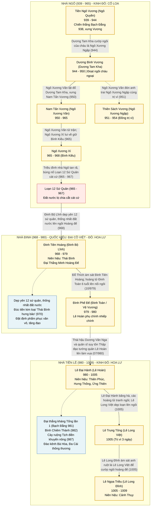

---

## 4. THỜI KỲ ĐẠI VIỆT - TRIỀU LÝ (1009 - 1225: 9 ĐỜI HOÀNG ĐẾ)

Triều đại đánh dấu sự định hình vững chắc của nền văn hiến Thăng Long, đặt tên nước **Đại Việt** (1054), mở đầu nền giáo dục khoa bảng Nho học và đỉnh cao Phật giáo dân tộc.

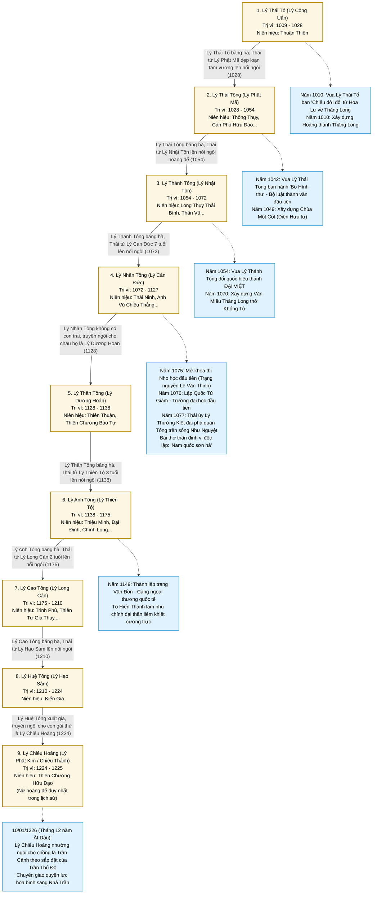

---

## 5. THỜI KỲ ĐẠI VIỆT - TRIỀU TRẦN, TRIỀU HỒ & NHÀ HẬU TRẦN (1226 - 1413)

Kỷ nguyên "Hào khí Đông A" lẫy lừng với 3 lần đánh bại đế quốc Mông - Nguyên hùng mạnh nhất thế giới thời bấy giờ, tiếp nối bởi cuộc cải cách của Nhà Hồ và kháng chiến chống Minh của Hậu Trần.

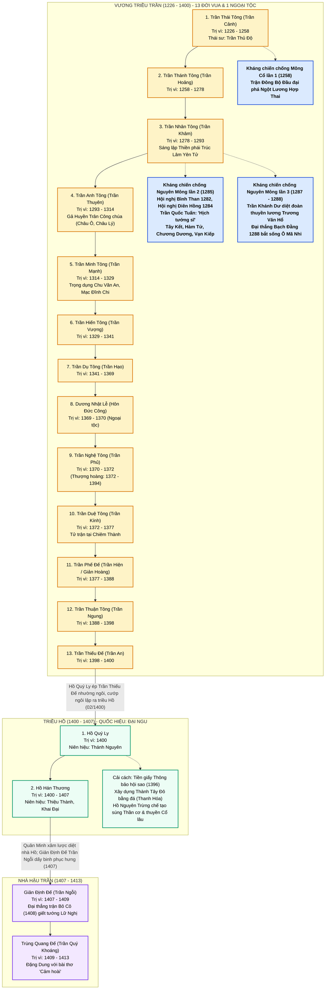

---

## 6. THỜI KỲ KHÁNG MINH & TRIỀU LÊ SƠ (1418 - 1527: 12 ĐỜI VUA)

Thời kỳ phục hưng vĩ đại sau 10 năm Khởi nghĩa Lam Sơn, phát triển cực thịnh dưới triều vua Lê Thánh Tông với văn trị võ công rực rỡ nhất trong lịch sử phong kiến Việt Nam.

```mermaid
flowchart TD
    classDef ls fill:#fff7ed,stroke:#ea580c,stroke-width:2px,color:#000;
    classDef leso fill:#fefce8,stroke:#ca8a04,stroke-width:2px,color:#000;
    classDef golden fill:#fef08a,stroke:#a16207,stroke-width:3px,font-weight:bold,color:#000;
    classDef decline fill:#fee2e2,stroke:#dc2626,stroke-width:1px,color:#000;

    subgraph SubLamSon ["10 NĂM KHỞI NGHĨA LAM SƠN (1418 - 1427)"]
        LS["Lê Lợi xưng Bình Định Vương (1418)<br>Quân sư Nguyễn Trãi - Hội thề Lũng Nhai<br>Trận Tốt Động - Chúc Động (1426)<br>Trận Chi Lăng - Xương Giang (1427) chém Liễu Thăng<br>Hội thề Đông Quan (12/1427) - Quân Minh rút về nước"]:::ls
    end

    subgraph SubLeSo ["12 ĐỜI VUA TRIỀU LÊ SƠ (1428 - 1527)"]
        L1["1. Lê Thái Tổ (Lê Lợi)<br>1428 - 1433 | Niên hiệu: Thuận Thiên<br>Nguyễn Trãi soạn 'Bình Ngô Đại Cáo'"]:::leso
        --> L2["2. Lê Thái Tông (Lê Nguyên Long)<br>1433 - 1442 | Vụ án Lệ Chi Viên (1442)"]:::leso
        --> L3["3. Lê Nhân Tông (Lê Bang Cơ)<br>1442 - 1459 | Thái hậu Nguyễn Thị Anh nhiếp chính"]:::leso
        --> L4["4. Lê Nghi Dân (Thiên Hưng Đế)<br>1459 - 1460 (8 tháng)"]:::decline
        --> L5["5. Lê Thánh Tông (Lê Tư Thành)<br>1460 - 1497 | Niên hiệu: Quang Thuận, Hồng Đức<br>★ THỜI KỲ HOÀNG KIM THỊNH TRỊ HỒNG ĐỨC ★"]:::golden
        --> L6["6. Lê Hiến Tông (Lê Tranh)<br>1497 - 1504 | Niên hiệu: Cảnh Thống"]:::leso
        --> L7["7. Lê Túc Tông (Lê Thuần)<br>1504 (6 tháng) | Niên hiệu: Thái Trinh"]:::leso
        --> L8["8. Lê Uy Mục (Lê Tuấn)<br>1504 - 1509 | 'Quỷ vương'"]:::decline
        --> L9["9. Lê Tương Dực (Lê Oanh)<br>1509 - 1516 | 'Trĩ vương' - Xây Cửu Trùng Đài"]:::decline
        --> L10["10. Lê Quang Trị<br>08/05/1516 (Trị vì 3 ngày)"]:::decline
        --> L11["11. Lê Chiêu Tông (Lê Y)<br>1516 - 1522 | Loạn Trần Cảo, Mạc Đăng Dung thao túng"]:::decline
        --> L12["12. Lê Cung Hoàng (Lê Xuân)<br>1522 - 1527 | Niên hiệu: Thống Nguyên"]:::decline

        %% Thành tựu thời Lê Thánh Tông
        E_GOLD["Thành tựu thời Lê Thánh Tông:<br>- Ban hành Quốc triều hình luật (Bộ luật Hồng Đức)<br>- Vẽ bản đồ Hồng Đức (bản đồ địa lý toàn quốc đầu tiên)<br>- Dựng Bia Tiến sĩ tại Văn Miếu (Thân Nhân Trung: 'Hiền tài là nguyên khí quốc gia')<br>- Sáng lập Tao Đàn Nhị thập bát tú"]:::golden
        L5 -.-> E_GOLD
    end

    LS -->|"Khởi nghĩa Lam Sơn toàn thắng; Lê Lợi lên ngôi Hoàng đế tại Thăng Long (1428)"| L1
```

---

## 7. THỜI KỲ NAM - BẮC TRIỀU & PHÂN LIỆT ĐÀNG TRONG - ĐÀNG NGOÀI (1527 - 1789)

Giai đoạn lịch sử phức tạp và biến động bậc nhất với sự cạnh tranh quyền lực song song giữa **Nhà Mạc** và **Lê Trung Hưng**, sau đó là cuộc phân tranh **Chúa Trịnh (Đàng Ngoài)** và **Chúa Nguyễn (Đàng Trong)**.

### 7.1. Vương Triều Mạc (1527 - 1677: 10 Đời Vua)
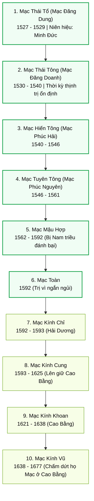

### 7.2. Nhà Lê Trung Hưng (1533 - 1789: 16 Đời Hoàng Đế)
```mermaid
flowchart TD
    classDef le_th fill:#fdf4ff,stroke:#c026d3,stroke-width:2px,color:#000;

    LH1["1. Lê Trang Tông (Lê Ninh)<br>1533 - 1548 | Nguyễn Kim phò tá tái lập nhà Lê"]:::le_th
    --> LH2["2. Lê Trung Tông (Lê Huyên)<br>1548 - 1556"]:::le_th
    --> LH3["3. Lê Anh Tông (Lê Duy Bang)<br>1556 - 1573"]:::le_th
    --> LH4["4. Lê Thế Tông (Lê Duy Đàm)<br>1573 - 1599 | Thu phục Thăng Long 1592"]:::le_th
    --> LH5["5. Lê Kính Tông (Lê Duy Tân)<br>1599 - 1619"]:::le_th
    --> LH6["6. Lê Thần Tông (Lê Duy Kỳ)<br>Lần 1: 1619 - 1643"]:::le_th
    --> LH7["7. Lê Chân Tông (Lê Duy Hựu)<br>1643 - 1649"]:::le_th
    --> LH8["6. Lê Thần Tông (Lên ngôi lần 2)<br>Lần 2: 1649 - 1662<br>(Làm cha của 4 vị vua kế tiếp)"]:::le_th
    --> LH9["8. Lê Huyền Tông (Lê Duy Vũ)<br>1662 - 1671"]:::le_th
    --> LH10["9. Lê Gia Tông (Lê Duy Cối)<br>1671 - 1675"]:::le_th
    --> LH11["10. Lê Hy Tông (Lê Duy Hợp)<br>1675 - 1705"]:::le_th
    --> LH12["11. Lê Dụ Tông (Lê Duy Đường)<br>1705 - 1729"]:::le_th
    --> LH13["12. Hôn Đức Công (Lê Duy Phường)<br>1729 - 1732"]:::le_th
    --> LH14["13. Lê Thuần Tông (Lê Duy Tường)<br>1732 - 1735"]:::le_th
    --> LH15["14. Lê Ý Tông (Lê Duy Thận)<br>1735 - 1740"]:::le_th
    --> LH16["15. Lê Hiển Tông (Lê Duy Diêu)<br>1740 - 1786 | Niên hiệu Cảnh Hưng 46 năm"]:::le_th
    --> LH17["16. Lê Chiêu Thống (Lê Duy Khiêm / Mẫn Đế)<br>1786 - 1789 | Vị vua cuối cùng nhà Hậu Lê"]:::le_th
```

### 7.3. Các Chúa Trịnh - Đàng Ngoài (1545 - 1787: 13 Đời Chúa)
```mermaid
flowchart TD
    classDef trinh fill:#f1f5f9,stroke:#475569,stroke-width:2px,color:#000;

    T1["1. Trịnh Kiểm (Thế Tổ Minh Khang Thái Vương)<br>1545 - 1570 | Khởi dựng cơ nghiệp họ Trịnh"]:::trinh
    --> T2["2. Trịnh Cối (Trung Bá Vương)<br>1570"]:::trinh
    --> T3["3. Trịnh Tùng (Thành Tổ Bình An Vương)<br>1570 - 1623 | Đánh bại nhà Mạc 1592, lập Phủ Chúa"]:::trinh
    --> T4["4. Trịnh Tráng (Văn Tổ Thanh Đô Vương)<br>1623 - 1657 | Mở đầu Trịnh - Nguyễn phân tranh (1627)"]:::trinh
    --> T5["5. Trịnh Tạc (Chiêu Tổ Tây Đô Vương)<br>1657 - 1682 | Lấy sông Gianh làm ranh giới (1672), dẹp Mạc Cao Bằng"]:::trinh
    --> T6["6. Trịnh Căn (Thuần Tổ Định Nam Vương)<br>1682 - 1709 | Cải cách quan chế, luật lệ"]:::trinh
    --> T7["7. Trịnh Cương (Nhân Tổ An Đô Vương)<br>1709 - 1729 | Đàng Ngoài thái bình, cải cách thuế khóa"]:::trinh
    --> T8["8. Trịnh Giang (Cao Tổ Uy Nam Vương)<br>1729 - 1740"]:::trinh
    --> T9["9. Trịnh Doanh (Ân Tổ Minh Đô Vương)<br>1740 - 1767 | Dẹp yên các cuộc khởi nghĩa nông dân"]:::trinh
    --> T10["10. Trịnh Sâm (Thánh Tổ Tĩnh Đô Vương)<br>1767 - 1782 | Đánh chiếm Phú Xuân của chúa Nguyễn (1775)"]:::trinh
    --> T11["11. Trịnh Cán (Điện Đô Vương)<br>1782 (Vài tuần tuổi)"]:::trinh
    --> T12["12. Trịnh Khải (Đoan Nam Vương)<br>1782 - 1786 | Loạn kiêu binh Tam phủ tôn lập"]:::trinh
    --> T13["13. Trịnh Bồng (Án Đô Vương)<br>1786 - 1787 | Chúa Trịnh cuối cùng"]:::trinh
```

### 7.4. Các Chúa Nguyễn - Đàng Trong (1558 - 1777: 10 Đời Chúa)
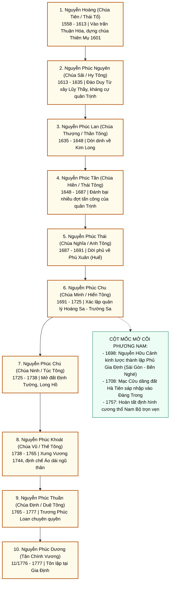

---

## 8. PHONG TRÀO & VƯƠNG TRIỀU TÂY SƠN (1771 - 1802: 3 ĐỜI VUA)

Trang sử chói lọi của phong trào nông dân khởi nghĩa quật khởi, xóa bỏ ranh giới chia cắt Đàng Trong - Đàng Ngoài và đánh tan hai cuộc xâm lược quy mô lớn của Xiêm La và Mãn Thanh.

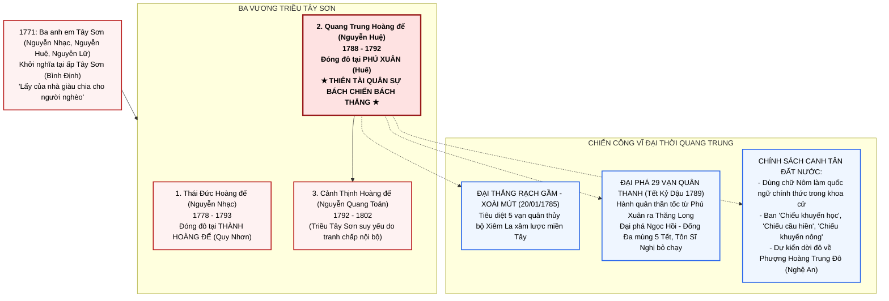

---

## 9. VƯƠNG TRIỀU NGUYỄN (1802 - 1945: 13 ĐỜI HOÀNG ĐẾ)

Vương triều phong kiến cuối cùng của Việt Nam, thống nhất giang sơn từ Ải Nam Quan đến Mũi Cà Mau, xác lập tên gọi **Việt Nam** và **Đại Nam**, đối diện với họa xâm lăng của thực dân Pháp và phong trào yêu nước.

```mermaid
flowchart TD
    classDef indep fill:#fef3c7,stroke:#d97706,stroke-width:2px,color:#000;
    classDef French fill:#fee2e2,stroke:#ef4444,stroke-width:2px,color:#000;
    classDef patriot fill:#f0fdf4,stroke:#15803d,stroke-width:2px,color:#000;
    classDef last fill:#f1f5f9,stroke:#64748b,stroke-width:2px,color:#000;

    subgraph SubDocLap ["GIAI ĐOẠN ĐỘC LẬP TỰ CHỦ (1802 - 1883)"]
        N1["1. Gia Long (Nguyễn Phúc Ánh)<br>1802 - 1820 | Quốc hiệu VIỆT NAM (1804)<br>Xây Kinh thành Huế - Bộ luật Gia Long<br>Cắm cờ xác lập chủ quyền Hoàng Sa, Trường Sa (1816)"]:::indep
        --> N2["2. Minh Mạng (Nguyễn Phúc Đảm)<br>1820 - 1841 | Quốc hiệu ĐẠI NAM (1838)<br>Cải cách chia 30 tỉnh & 1 phủ Thừa Thiên (1831-1832)<br>Châu bản triều Nguyễn, Quốc Sử Quán"]:::indep
        --> N3["3. Thiệu Trị (Nguyễn Phúc Miên Tông)<br>1841 - 1847 | 'Thần kinh nhị thập cảnh'"]:::indep
        --> N4["4. Tự Đức (Nguyễn Phúc Hồng Nhậm)<br>1847 - 1883 (36 năm trị vì)<br>Pháp nổ súng đánh Đà Nẵng 1858<br>Ký các hiệp ước 1862, 1874"]:::indep
    end

    subgraph SubBienDong ["GIAI ĐOẠN BIẾN ĐỘNG & 'TỨ NGUYỆT TAM VƯƠNG' (1883 - 1885)"]
        N5["5. Dục Đức (Ưng Chân)<br>1883 (Trị vì 3 ngày)"]:::French
        --> N6["6. Hiệp Hòa (Hồng Dật)<br>1883 (4 tháng) | Ký Hiệp ước Quý Mùi 1883"]:::French
        --> N7["7. Kiến Phúc (Ưng Đăng)<br>1883 - 1884 | Ký Hiệp ước Giáp Thân (Patrenôtre 1884)"]:::French
        --> N8["8. Hàm Nghi (Ưng Lịch)<br>1884 - 1885 | Ban 'Chiếu Cần Vương' kêu gọi kháng Pháp<br>Bị đày sang Algérie"]:::patriot
    end

    N4 --> N5

    subgraph SubPhapThuoc ["GIAI ĐOẠN PHÁP THUỘC & PHONG TRÀO YÊU NƯỚC (1885 - 1945)"]
        N9["9. Đồng Khánh (Ưng Kỷ)<br>1885 - 1889"]:::French
        --> N10["10. Thành Thái (Bửu Lân)<br>1889 - 1907 | Vua yêu nước, tư tưởng canh tân<br>Thực dân Pháp phế truất vì chống đối, đày sang đảo Réunion"]:::patriot
        --> N11["11. Duy Tân (Vĩnh San)<br>1907 - 1916 | Khởi nghĩa Quang Phục Hội thất bại<br>Thực dân Pháp đày sang đảo Réunion cùng vua cha"]:::patriot
        --> N12["12. Khải Định (Bửu Đảo)<br>1916 - 1925 | Xây Lăng Ứng Lăng (Huế)"]:::French
        --> N13["13. Bảo Đại (Vĩnh Thụy)<br>1926 - 1945 | Vị Hoàng đế cuối cùng"]:::last
    end

    N8 -->|"Thực dân Pháp phế truất vua Hàm Nghi, tôn lập vua bù nhìn Đồng Khánh (1885)"| N9

    ABDICATION["THOÁI VỊ LỊCH SỬ TẠI NGỌ MÔN (30/08/1945):<br>Vua Bảo Đại trao ấn vàng và kiếm ngọc cho đại diện Chính phủ lâm thời VNDCCH:<br>'Trẫm thà làm dân một nước độc lập, hơn làm vua một nước nô lệ'<br>Khép lại vĩnh viễn chế độ quân chủ chuyên chế tại Việt Nam"]:::last
    N13 -.-> ABDICATION
```

---

## 10. KỶ NGUYÊN ĐỘC LẬP, THỐNG NHẤT & HIỆN ĐẠI (1945 - NAY)

Kỷ nguyên mở đầu bằng Tuyên ngôn Độc lập khai sinh nước Việt Nam Dân chủ Cộng hòa, trải qua hai cuộc kháng chiến vĩ đại bảo vệ tổ quốc, hoàn thành thống nhất non sông, Đổi Mới và hội nhập toàn diện, tự tin bước vào kỷ nguyên vươn mình của dân tộc.

```mermaid
flowchart TD
    classDef step fill:#f0f9ff,stroke:#0284c7,stroke-width:2px,color:#000;
    classDef victory fill:#dcfce7,stroke:#16a34a,stroke-width:2px,color:#000,font-weight:bold;
    classDef modern fill:#fefce8,stroke:#eab308,stroke-width:2px,color:#000;

    M1["CÁCH MẠNG THÁNG TÁM & TUYÊN NGÔN ĐỘC LẬP (1945)<br>- 19/08/1945: Khởi nghĩa giành chính quyền thắng lợi ở Hà Nội<br>- 02/09/1945: Chủ tịch Hồ Chí Minh đọc Tuyên ngôn Độc lập tại Quảng trường Ba Đình<br>Khai sinh nước VIỆT NAM DÂN CHỦ CỘNG HÒA"]:::step
    --> M2["CUỘC KHÁNG CHIẾN CHỐNG THỰC DÂN PHÁP (1946 - 1954)<br>- 19/12/1946: Lời kêu gọi Toàn quốc kháng chiến<br>- 1947: Chiến thắng Việt Bắc Thu - Đông bẻ gãy gọng kìm Pháp<br>- 1950: Chiến dịch Biên Giới giải phóng biên giới Việt - Trung<br>- 07/05/1954: ĐẠI THẮNG ĐIỆN BIÊN PHỦ 'lừng lẫy năm châu, chấn động địa cầu'<br>- 21/07/1954: Ký Hiệp định Genève, lập lại hòa bình ở Đông Dương"]:::step
    --> M3["CUỘC KHÁNG CHIẾN CHỐNG MỸ CỨU NƯỚC (1954 - 1975)<br>- Miền Bắc xây dựng CNXH & làm hậu phương lớn cho Miền Nam<br>- 1960: Phong trào Đồng Khởi bùng nổ khắp Nam Bộ<br>- 1968: Tổng tiến công và nổi dậy Tết Mậu Thân làm phá sản 'Chiến tranh cục bộ'<br>- 12/1972: Chiến thắng 'Điện Biên Phủ trên không' đập tan tập kích B-52<br>- 27/01/1973: Ký Hiệp định Paris buộc quân Mỹ rút về nước<br>- 30/04/1975: ĐẠI THẮNG MÙA XUÂN & CHIẾN DỊCH HỒ CHÍ MINH<br>Giải phóng hoàn toàn Miền Nam, thống nhất đất nước!"]:::victory
    --> M4["GIAI ĐOẠN HẬU CHIẾN, THỐNG NHẤT & BẢO VỆ BIÊN GIỚI (1975 - 1985)<br>- 02/07/1976: Quốc hội khóa VI đổi quốc hiệu: CỘNG HÒA XÃ HỘI CHỦ NGHĨA VIỆT NAM<br>- 1979: Chiến tranh bảo vệ biên giới Tây Nam (giúp Campuchia thoát họa diệt chủng)<br>- 1979: Chiến tranh bảo vệ biên giới Phía Bắc giữ vững toàn vẹn lãnh thổ"]:::step
    --> M5["KỶ NGUYÊN ĐỔI MỚI TOÀN DIỆN (1986 - 2000)<br>- 12/1986: Đại hội Đảng lần thứ VI khởi xướng đường lối ĐỔI MỚI toàn diện<br>- 1991: Bình thường hóa quan hệ ngoại giao Việt Nam - Trung Quốc<br>- 1995: Bình thường hóa quan hệ ngoại giao Việt Nam - Hoa Kỳ<br>- 28/07/1995: Việt Nam chính thức gia nhập ASEAN"]:::modern
    --> M6["KỶ NGUYÊN HỘI NHẬP SÂU RỘNG & PHÁT TRIỂN (2001 - 2020)<br>- 2001: Ký kết Hiệp định Thương mại song phương Việt Nam - Hoa Kỳ (BTA)<br>- 11/01/2007: Việt Nam chính thức trở thành thành viên thứ 150 của WTO<br>- 2018 - 2020: Ký kết và thực thi các FTA thế hệ mới hàng đầu: CPTPP, EVFTA<br>- 2020: Kiểm soát thành công đại dịch COVID-19, phục hồi kinh tế mạnh mẽ"]:::modern
    --> M7["KỶ NGUYÊN VƯƠN MÌNH & VỊ THẾ CHIẾN LƯỢC TOÀN DIỆN (2021 - 2026+)<br>- Đại hội XIII (2021) xác định mục tiêu phát triển đến 2030 và tầm nhìn 2045<br>- Nâng cấp quan hệ Đối tác Chiến lược Toàn diện với các cường quốc (Mỹ, Nhật Bản, Úc, Pháp...)<br>- Chuyển đổi số quốc gia, phát triển kinh tế xanh, kinh tế tri thức và công nghệ cao<br>- Khẳng định chủ quyền bất khả xâm phạm tại Biển Đông, Hoàng Sa và Trường Sa"]:::modern
```

---

## 11. BẢNG TỔNG HỢP QUỐC HIỆU & KINH ĐÔ LỊCH SỬ

| Thời kỳ / Triều đại | Năm | Quốc hiệu | Kinh đô / Trị sở | Người sáng lập / Trọng mốc |
| :--- | :--- | :--- | :--- | :--- |
| **Kỷ Hồng Bàng** | 2879 TCN | **Xích Quỷ** | Phong Châu | Kinh Dương Vương (Lộc Tục) |
| **Nhà nước Văn Lang** | Tk VII TCN | **Văn Lang** | Phong Châu (Phú Thọ) | Hùng Vương (18 đời) |
| **Nước Âu Lạc** | 257 TCN | **Âu Lạc** | Cổ Loa (Đông Anh, Hà Nội) | An Dương Vương (Thục Phán) |
| **Nhà Triệu** | 207 TCN | **Nam Việt** | Phiên Ngung (Quảng Châu) | Triệu Vũ Đế (Triệu Đà) |
| **Trưng Vương** | 40 SCN | — | Mê Linh (Hà Nội) | Trưng Trắc & Trưng Nhị |
| **Nhà Tiền Lý** | 544 SCN | **Vạn Xuân** | Long Biên (Hà Nội) | Lý Nam Đế (Lý Bí) |
| **Nhà Ngô** | 939 | — | Cổ Loa (Hà Nội) | Tiền Ngô Vương (Ngô Quyền) |
| **Nhà Đinh** | 968 | **Đại Cồ Việt** | Hoa Lư (Ninh Bình) | Đinh Tiên Hoàng (Đinh Bộ Lĩnh) |
| **Nhà Tiền Lê** | 980 | **Đại Cồ Việt** | Hoa Lư (Ninh Bình) | Lê Đại Hành (Lê Hoàn) |
| **Triều Lý** | 1009 / 1054 | **Đại Cồ Việt** -> **Đại Việt** (1054) | Thăng Long (Hà Nội) | Lý Thái Tổ (Dời đô 1010) / Lý Thánh Tông |
| **Triều Trần** | 1226 | **Đại Việt** | Thăng Long (Hà Nội) | Trần Thái Tông (Trần Cảnh) |
| **Triều Hồ** | 1400 | **Đại Ngu** | Tây Đô (Thanh Hóa) | Hồ Quý Ly |
| **Nhà Hậu Trần** | 1407 | **Đại Việt** | Mô Độ (Ninh Bình) / Nghệ An | Giản Định Đế (Trần Ngỗi) |
| **Nhà Lê Sơ** | 1428 | **Đại Việt** | Đông Kinh (Thăng Long) | Lê Thái Tổ (Lê Lợi) |
| **Nhà Mạc** | 1527 | **Đại Việt** | Đông Kinh / Cao Bằng (1593) | Mạc Thái Tổ (Mạc Đăng Dung) |
| **Lê Trung Hưng** | 1533 | **Đại Việt** | Vạn Lại - Yên Trường / Thăng Long | Lê Trang Tông / Nguyễn Kim phò tá |
| **Chúa Trịnh** | 1545 | — (Phủ Chúa) | Thăng Long (Đàng Ngoài) | Trịnh Kiểm / Trịnh Tùng |
| **Chúa Nguyễn** | 1558 | — (Dinh Chúa) | Ái Tử, Trà Bát, Kim Long, Phú Xuân | Nguyễn Hoàng (Đàng Trong) |
| **Nhà Tây Sơn** | 1778 | — | Hoàng Đế thành (Quy Nhơn) / Phú Xuân | Nguyễn Nhạc / Nguyễn Huệ |
| **Vương triều Nguyễn** | 1802 / 1804 | **Việt Nam** (1804) -> **Đại Nam** (1838) | Phú Xuân (Huế) | Gia Long / Minh Mạng |
| **Việt Nam Dân chủ Cộng hòa** | 02/09/1945 | **Việt Nam Dân chủ Cộng hòa** | Hà Nội | Chủ tịch Hồ Chí Minh |
| **Cộng hòa Xã hội Chủ nghĩa Việt Nam** | 02/07/1976 | **Cộng hòa Xã hội Chủ nghĩa Việt Nam** | Thủ đô Hà Nội | Quốc hội khóa VI nước Việt Nam thống nhất |

---

> [!TIP]
> **Hướng dẫn xem và tích hợp biểu đồ**:
> - Tài liệu này tương thích 100% với trình kết xuất Mermaid trên GitHub, GitLab, VS Code Markdown Preview, Obsidian và các thư viện JavaScript Mermaid tiêu chuẩn.
> - Để tra cứu chi tiết diễn biến từng sự kiện theo ngày tháng năm tương ứng, bạn có thể tham khảo trực tiếp hai tệp niên biểu đồng bộ hóa [`timelines_vi.md`](timelines_vi.md) (Tiếng Việt) và [`timelines_en.md`](timelines_en.md) (Tiếng Anh), hoặc trải nghiệm ứng dụng Web tương tác tại [`index.html`](index.html).
